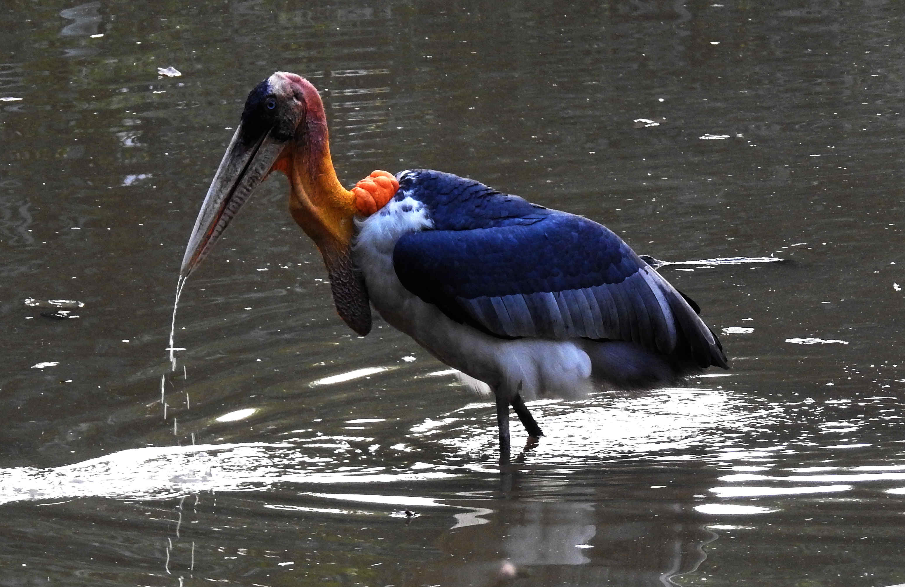

Flamingo  

 
Source: [Arpingstone](https://commons.wikimedia.org/wiki/File:Caribbean_Flamingo.jpg "via Wikimedia Commons") / Public domain

* Diet: Plants, insects, blue-green algae, shrimp
* Top Speed: 56 km/hr
* Life Span: 20-30 yrs
* Height: 3.9-4.7 ft
* Weight: 3.5 kg
* Wing Span: 94 cm to 150 cm
* No of species: 6  

-----
Spotted billed or Grey Pelican  

 
Source: [Arpingstone](https://commons.wikimedia.org/wiki/File:Caribbean_Flamingo.jpg "via Wikimedia Commons") / Public domain

* Diet: Fish
* Top Speed: km/hr
* Life Span:  yrs
* Height:  ft
* Weight:  kg
* Wing Span:  cm
* No of species:
* Distribution: South Asia - India, Pak, Indonesia
-----
Openbilled Stork  

 
Source: [Arpingstone](https://commons.wikimedia.org/wiki/File:Caribbean_Flamingo.jpg "via Wikimedia Commons") / Public domain

* Diet: 
* Top Speed: km/hr
* Life Span:  yrs
* Height:  ft
* Weight:  kg
* Wing Span:  cm
* No of species:
* Distribution:  
-----
Painted Stork  

 
Source: [Arpingstone](https://commons.wikimedia.org/wiki/File:Caribbean_Flamingo.jpg "via Wikimedia Commons") / Public domain

* Diet: 
* Top Speed: km/hr
* Life Span:  yrs
* Height:  ft
* Weight:  kg
* Wing Span:  cm
* No of species:
* Distribution:  
-----
Adjutant Stork  

 
Source: [Arpingstone](https://commons.wikimedia.org/wiki/File:Caribbean_Flamingo.jpg "via Wikimedia Commons") / Public domain

* Diet: 
* Top Speed: km/hr
* Life Span:  yrs
* Height:  ft
* Weight:  kg
* Wing Span:  cm
* No of species:
* Distribution:  
-----
Spoonbill  

 
Source: [Arpingstone](https://commons.wikimedia.org/wiki/File:Caribbean_Flamingo.jpg "via Wikimedia Commons") / Public domain

* Diet: 
* Top Speed: km/hr
* Life Span:  yrs
* Height:  ft
* Weight:  kg
* Wing Span:  cm
* No of species:
* Distribution:  
-----